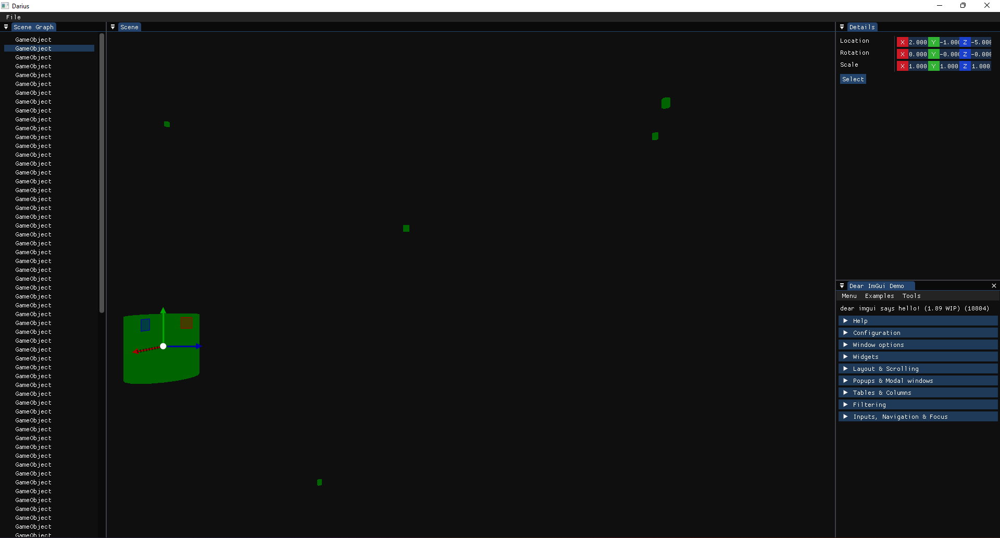
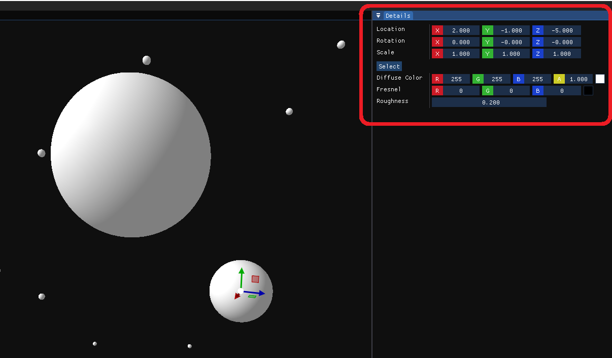
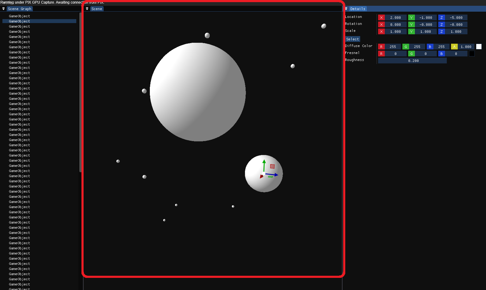

# Darius Engine

## First Look

This is how the editor looks like. You can select game objects from Scene Graph window and change its transform properties and mesh trough Details window. You also can change object position via the gizmo which is located on object position.

You can explore the scene with ghost camera by holding mouse right-button and via W/A/S/D.

## Interaction

### Scene Graph Window
<table border="0" width="100%">
 <tr>
    <td width="80%"></td>
    <td style="vertical-align:text-top">This is the Scene Graph window and all objects in the scene are shown here. You can select a game object through this window and start interacting with the object.</td>
 </tr>
</table>

### Details Window
<table border="0" width="100%">
 <tr>
    <td width="80%"></td>
    <td style="vertical-align:text-top">You can change object property via Detail window. It is currently support modifying object transformation, shape and material.</td>
 </tr>
</table>

### Scene Window

Scene window shows the active 3D scene from perspective of editor camera. You can see how are objects will be shown in your scene through this window. Selected object location can be modified via the gizmo which always appears on object location.

You can change your view by holding mouse right-button and move your mouse. You can also move while holding right-click using W/A/S/D keys on your keyboard.

## Installing

1. Clone the repository and its submodules:

    `git clone --recursive https://github.com/MohammadMDSA/Darius.git`

2. Install dependencies
    1. Install Boost and have `Boost_ROOT` environment variable pointing to where you've installed Boost.
    2. Install FBX SDK.
        1. Download FBX SDK 2020 from [FBX SDK website](https://autodesk.com/fbx) and install it.
        2. Have `FBXSDK_ROOT` system environment variable pointing to where you've installed FBX SDK.
3. Configure and Build using CMake and *MSVC* compiler. (Other compilers *may* work but not tested)

4. Run `DariusEngine` executable to run Darius Editor.