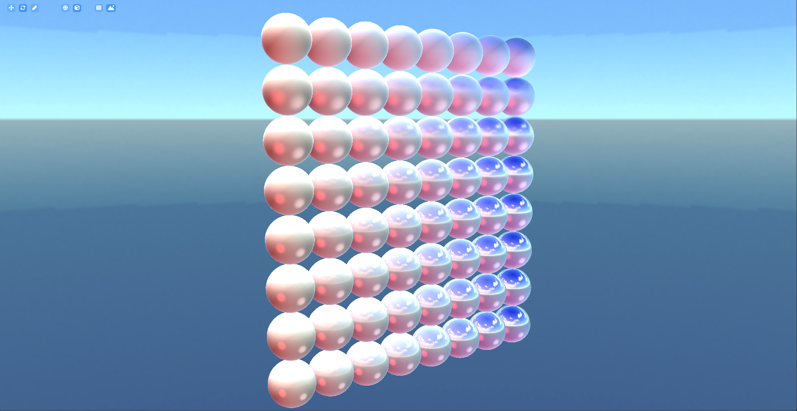
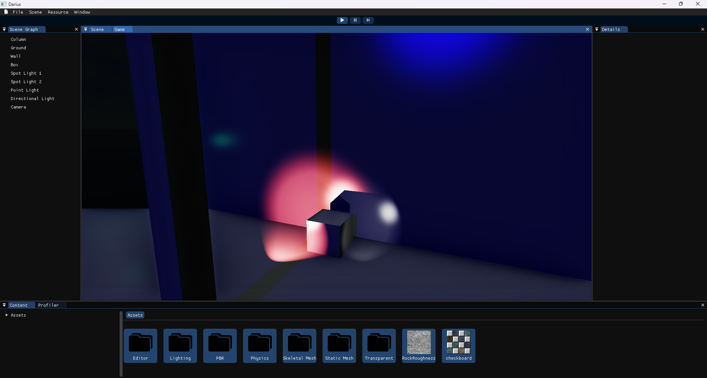

# Darius Engine

## First Look

---

## Features
- Core
    - Runtime Type Reflection
    - Code Generation
        - Auto Type Reflection Registeration
        - Auto Serialization and Deserialization
- Resource Management
    - Default: PBR Material, Texture (DDS, TGA), Static and Skeletal Mesh (FBX), Animation (FBX), Vertex Batch Resources, and Physics Material
    - Dynamic Resource Type Registration (You can define your own types)
- Renderer
    - DirectX 12 Vendor
    - Anti-Aliasing 
        - TAA
    - Post Processing
        - Tone Mapping
    - Physics-Based Rendering (PBR) Materials
        - Diffuse, Normal, Roughness, Metallic, and Emissive Textures Mapping
        - Diffuse Albedo, Emissive, Metallic, and Roughness Components
        - Opaque, Transparent, and Cutoff
        - Multiple Sub-Meshes
    - Lighting
        - Blinn-Phong Model
        - Shadow Mapping
    - Texture Filtering
    - Skybox
    - Static and Skinned Mesh Rendering
    - Optimizations
        - Frustum Culling
        - Separate Z Pass
        - Pipeline Caching
    - PIX Debugging Integration
- Debug
    - Debug Draws
- Scene Management
    - Saving & Loading
    - Entity Component System Architecture
    - Scene Graph and Hierarchical Transform Math
- Physics
    - Dynamic, Static, and Kinematic Actors
    - Physics Material
    - Collision Handling
        - Box, and Sphere Colliders
    - Scene Query
        - Ray Casting
- Editor
    - Resource Monitor
    - Ghost and Orbit Cameras
    - Gizmos (Translation, Rotation, and Scale)
    - Simulation (Run, Stop, Pause, and Step)
    - Profiler Graph
    - Game Object Property Manipulation through GUI (including components)
    - Resource Property Manipulation through GUI (including saving & loading)
- Job System and CPU Multi-Core Utilization
- CPU & GPU Profiling
    - Framerate Metrics (Last, Max, Avg)
    - Framerate Graphs
    - CPU Frame Snapshot and Flame Graph
- And so much more!

---

### PBR Material

 

### Lighting

 

### Mesh Rendering (Skinned and Static)

 

### Skinned Mesh Animation

---

## Installing

1. Clone the repository and its submodules:

    `git clone --recursive https://github.com/MohammadMDSA/Darius.git`

2. Install dependencies
    1. Install Boost and have `Boost_ROOT` environment variable pointing to where you've installed Boost.
    2. Install FBX SDK.
        1. Download FBX SDK 2020 from [FBX SDK website](https://autodesk.com/fbx) and install it.
        2. Have `FBXSDK_ROOT` system environment variable pointing to where you've installed FBX SDK.
    3. Install Pix and have `WinPixEventRuntime_DIR` enviroment variable pointing to its install directory. It must contain `Include/` and `bin/` as its subdirectories
3. Configure and Build using CMake and *MSVC* compiler. (Other compilers *may* work but have not been tested)

4. Run `Darius` executable to run Darius Editor with demo project.